# 📦 Manual de Instalación — PathFinderAI

> Guía paso a paso para instalar, configurar y ejecutar **PathFinderAI** en un entorno de desarrollo local.
>
> *Proyecto Final de Ciclo Formativo de Grado Superior en Desarrollo de Aplicaciones Web (DAW) — I.E.S. «Venancio Blanco» (Salamanca)*

---

## Índice

1. [Requisitos previos](#1-requisitos-previos)
2. [Configuración del entorno](#2-configuración-del-entorno)
3. [Inicialización de la base de datos](#3-inicialización-de-la-base-de-datos)
4. [Ejecución del sistema](#4-ejecución-del-sistema)
5. [Ejecución de tests](#5-ejecución-de-tests)
6. [Verificación final](#6-verificación-final)
7. [Resolución de problemas](#7-resolución-de-problemas)

---

## 1. Requisitos previos

Antes de instalar PathFinderAI, asegúrese de disponer del siguiente software y cuentas de servicio.

### 1.1. Software necesario

| Herramienta | Versión mínima | Comprobación | Descarga |
| :--- | :--- | :--- | :--- |
| **Node.js** | 18.x o superior | `node --version` | <https://nodejs.org/> |
| **npm** | 9.x o superior | `npm --version` | (incluido con Node.js) |
| **Git** | 2.x o superior | `git --version` | <https://git-scm.com/> |
| **Editor de código** | — | — | Visual Studio Code (recomendado) |
| **Navegador moderno** | — | — | Chrome, Edge o Firefox |

**Captura 1.1** — Terminal mostrando las versiones de Node.js, npm y Git instaladas:


### 1.2. Cuentas de servicios externos

PathFinderAI depende de tres servicios externos. Cree una cuenta gratuita en cada uno:

| Servicio | Para qué se usa | Enlace |
| :--- | :--- | :--- |
| **Supabase** | Base de datos PostgreSQL y autenticación | <https://supabase.com> |
| **Google Cloud** | OAuth 2.0 (inicio de sesión con Google) | <https://console.cloud.google.com/> |
| **Google AI Studio** | Clave de API para Gemini | <https://makersuite.google.com/app/apikey> |
| **Google Cloud** | API Key para YouTube Data API v3 | <https://console.cloud.google.com/> |

**Captura 1.2** — Pantalla principal de Supabase tras iniciar sesión:

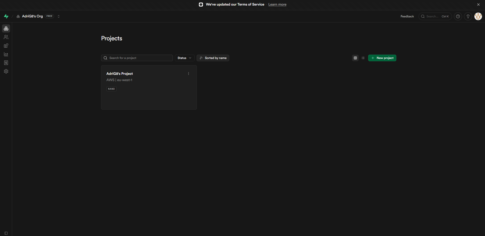

**Captura 1.3** — Pantalla principal de Google Cloud Console:

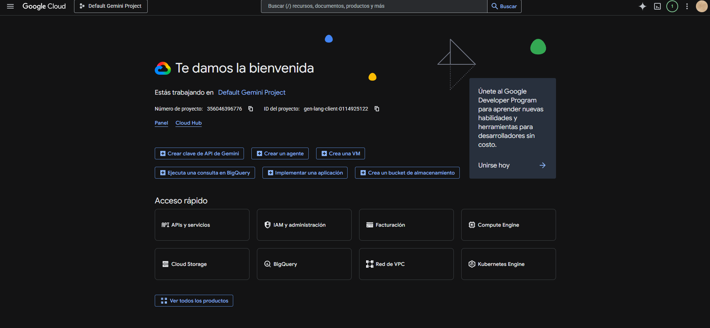

**Captura 1.4** — Pantalla principal de Google AI Studio:

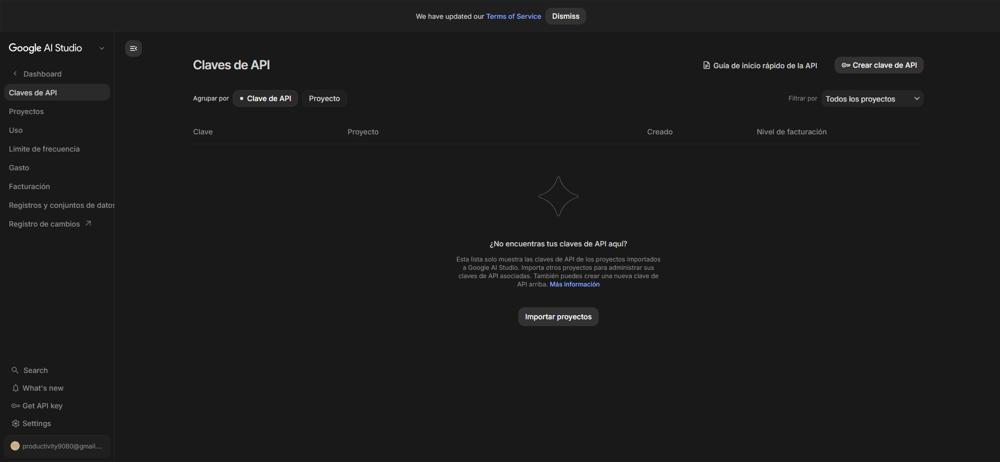

### 1.3. Clonado del repositorio

Abra una terminal en el directorio donde desea instalar el proyecto y ejecute:

```bash
git clone https://github.com/AdriG8/PathFinderAI.git
cd PathFinderAI
```

**Captura 1.5** — Terminal mostrando el resultado del `git clone` y el cambio al directorio del proyecto:

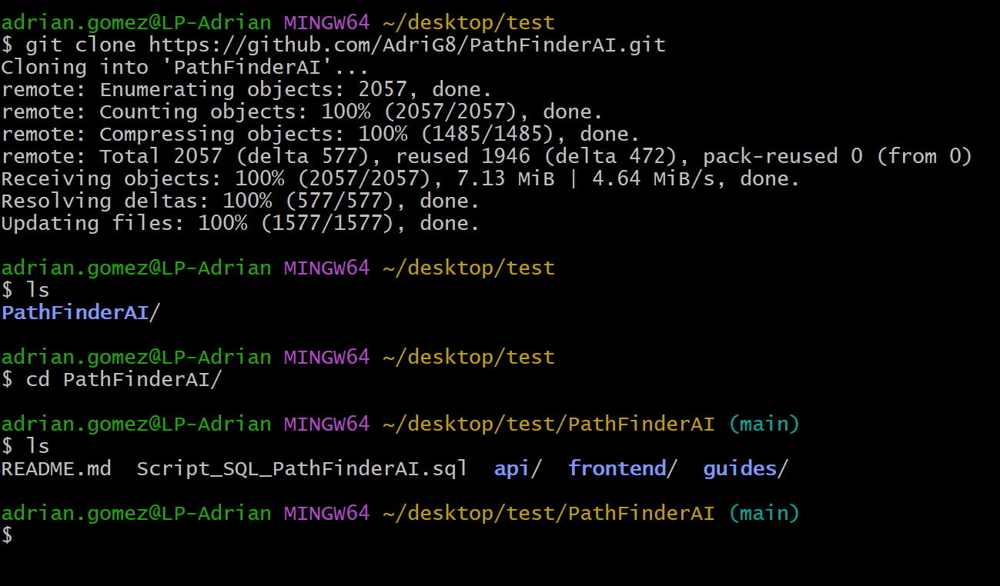

**Captura 1.6** — Estructura del proyecto abierta en Visual Studio Code (carpetas `api/` y `frontend/`):

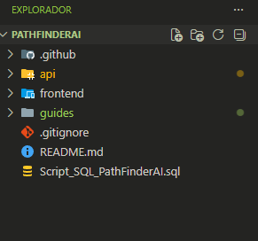

---

## 2. Configuración del entorno

PathFinderAI se compone de **dos subproyectos**: una API en Node.js (`api/`) y una aplicación React (`frontend/`). Cada uno tiene su propio archivo `.env` con credenciales.

### 2.1. Crear un proyecto en Supabase

1. Inicie sesión en <https://supabase.com> y pulse **New project**.
2. Asigne un nombre (p. ej. `pathfinderai`), una contraseña para la base de datos y una región cercana.
3. Espere a que termine el aprovisionamiento (1–2 minutos).
4. En **Project Settings → API**, copie:
   - **Project URL** → corresponde a `VITE_SUPABASE_URL`.
   - **anon public** → corresponde a `VITE_SUPABASE_ANON_KEY`.
   - **service_role** → corresponde a `SUPABASE_SERVICE_ROLE_KEY` (⚠️ ¡secreta!).

**Captura 2.1** — Formulario de creación de un nuevo proyecto en Supabase:

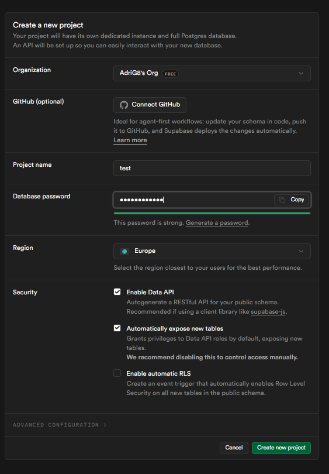

**Captura 2.2** — Sección **Project Settings → API** con la **Project URL** y la **publishable key**:


**Captura 2.2 (bis)** — Claves **anon** y **service_role** del mismo apartado:


### 2.2. Configurar Google OAuth

1. Acceda a <https://console.cloud.google.com/> y cree o seleccione un proyecto.
2. Vaya a **APIs y servicios → Credenciales** y pulse **Crear credenciales → ID de cliente OAuth 2.0**.
3. Tipo de aplicación: **Aplicación web**.
4. En **Orígenes JavaScript autorizados** añada:
   - `http://localhost:5173`
5. En **URIs de redirección autorizadas** añada la que Supabase le indique en *Authentication → Providers → Google* (formato: `https://<su-proyecto>.supabase.co/auth/v1/callback`).
6. Copie el **Client ID** y el **Client Secret**.
7. En el dashboard de Supabase, abra **Authentication → Providers → Google**, active el proveedor y pegue el Client ID y el Client Secret.

**Captura 2.3** — Sección **Credenciales** en Google Cloud:

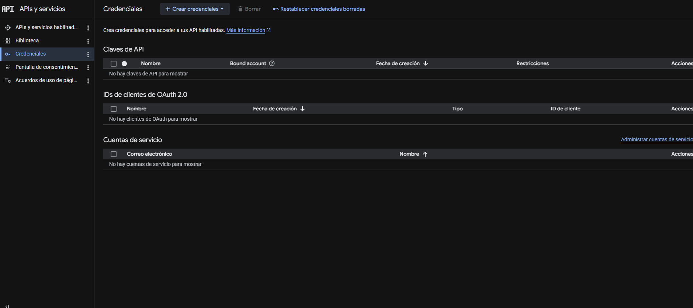

**Captura 2.3 (bis)** — Formulario **Crear ID de cliente OAuth 2.0**:

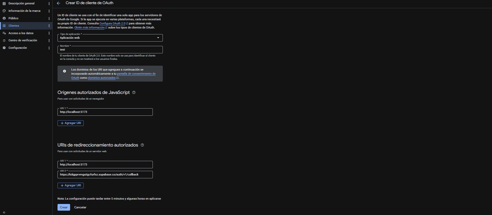

**Captura 2.4** — URI de redirección autorizado (callback de Supabase) configurado:

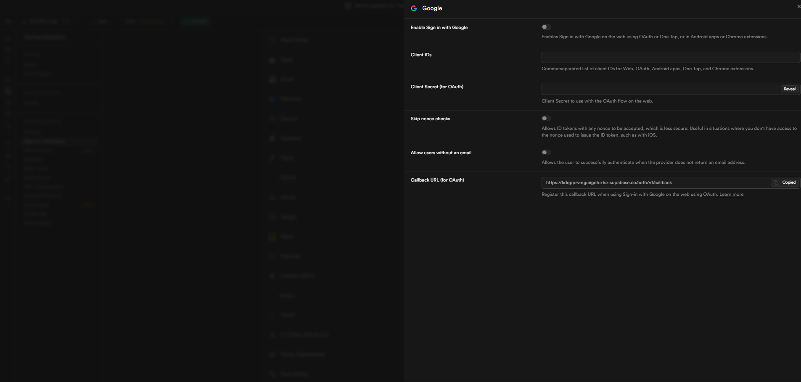

**Captura 2.5** — Provider **Google** dentro de **Authentication → Providers** de Supabase:

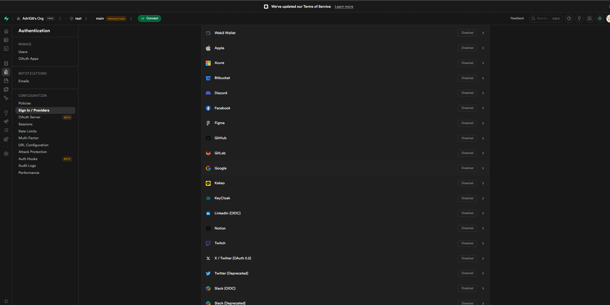

**Captura 2.5 (bis)** — Client ID y Client Secret obtenidos en Google Cloud:

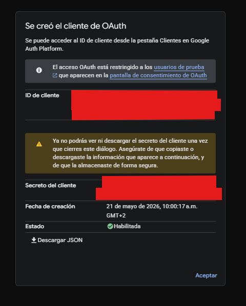

**Captura 2.5 (ter)** — Provider Google activado en Supabase con las credenciales pegadas:

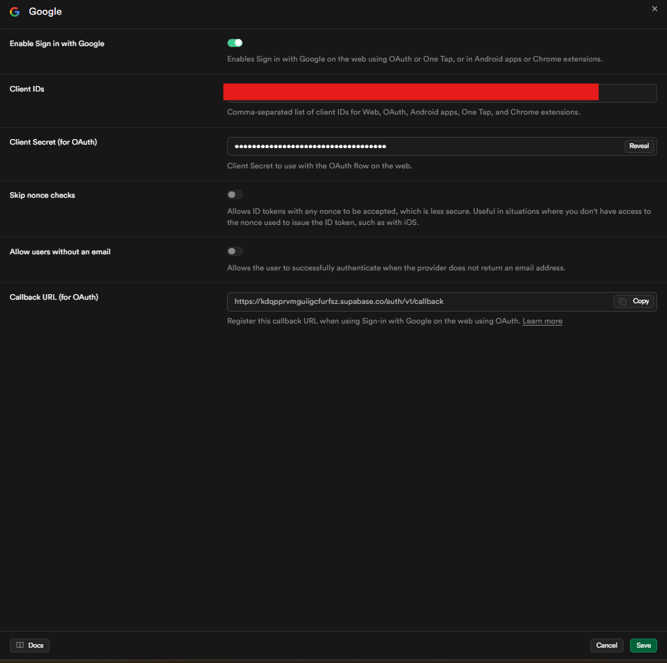

### 2.3. Obtener la clave de Gemini

1. Acceda a <https://makersuite.google.com/app/apikey>.
2. Pulse **Create API key** y seleccione el proyecto de Google Cloud creado anteriormente.
3. Copie la clave generada — corresponde a `GEMINI_API_KEY`.

**Captura 2.6** — Botón **Create API key** en Google AI Studio:

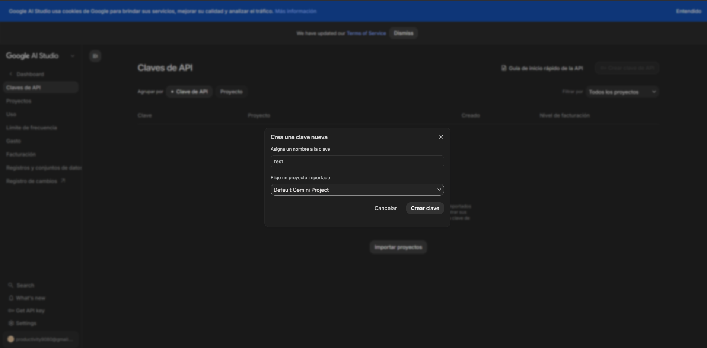

**Captura 2.6 (bis)** — Clave de API recién generada:

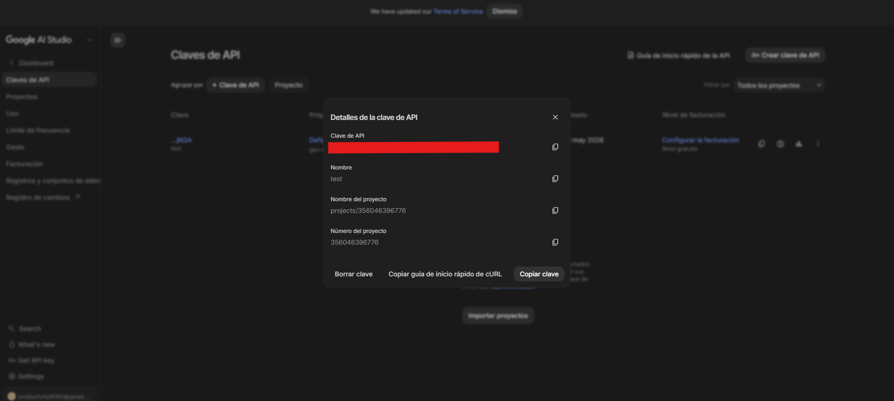

### 2.4. Obtener la clave de YouTube Data API

1. Acceda a <https://console.cloud.google.com/> y seleccione el mismo proyecto usado para OAuth.
2. Vaya a **APIs y servicios → Biblioteca**.
3. Busque **YouTube Data API v3** y haga clic en **Habilitar**.
4. Una vez habilitada, vaya a **APIs y servicios → Credenciales**.
5. Pulse **+ Crear credenciales → Clave de API**.
6. Copie la clave generada — corresponde a `API_KEY_YT_SEARCH`.
7. (Opcional pero recomendado) Restrinja la clave: en la edición de la clave, en **Restricciones de API**, seleccione **YouTube Data API v3**.

**Captura 2.7** — YouTube Data API v3 habilitada en Google Cloud:

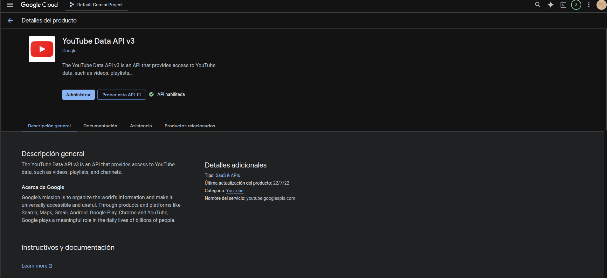

**Captura 2.7 (bis)** — Creación de la clave de API para YouTube:

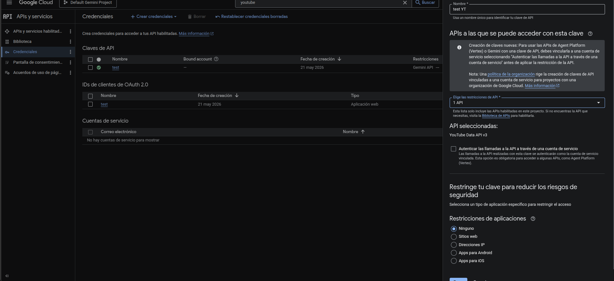

### 2.5. Configurar la API (`api/.env`)

```bash
cd api
npm install
```

Cree el archivo `api/.env` con el siguiente contenido y rellene los valores con los obtenidos en los pasos anteriores:

```env
# Supabase
VITE_SUPABASE_URL=https://tu-proyecto.supabase.co
VITE_SUPABASE_ANON_KEY=tu-anon-key
SUPABASE_SERVICE_ROLE_KEY=tu-service-role-key

# Google Gemini
GEMINI_API_KEY=tu-gemini-api-key

# URL del frontend
SITE_URL=http://localhost:5173

# YouTube Data API
API_KEY_YT_SEARCH=tu-youtube-api-key
```

**Captura 2.8** — Terminal mostrando el `npm install` completado dentro de `api/`:

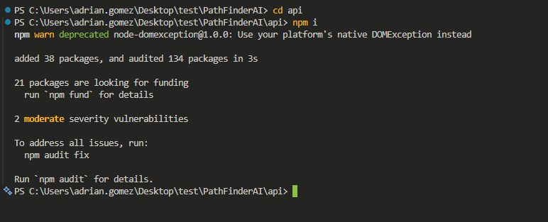

**Captura 2.9** — Archivo `api/.env` abierto en VS Code con las variables rellenadas:

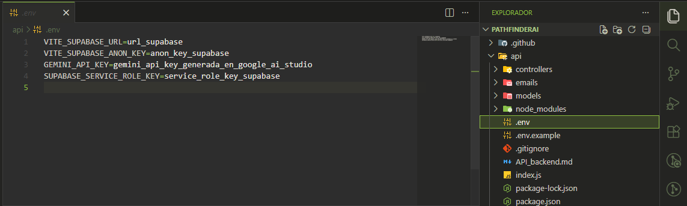

### 2.6. Configurar el frontend (`frontend/.env`)

En otra terminal:

```bash
cd frontend
npm install
```

Cree `frontend/.env` con el siguiente contenido:

```env
VITE_API_URL=http://localhost:3000
VITE_SUPABASE_URL=https://tu-proyecto.supabase.co
VITE_SUPABASE_ANON_KEY=tu-anon-key
VITE_GOOGLE_CLIENT_ID=tu-google-client-id.apps.googleusercontent.com
```

**Captura 2.10** — Terminal mostrando el `npm install` completado dentro de `frontend/`:

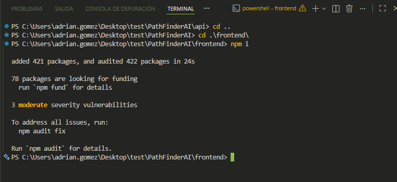

**Captura 2.11** — Archivo `frontend/.env` abierto en VS Code con las variables rellenadas:

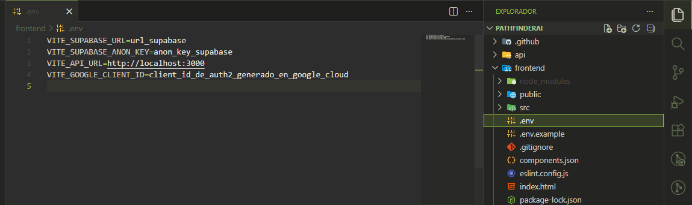

---

## 3. Inicialización de la base de datos

PathFinderAI utiliza tres tablas en Supabase: `Usuarios`, `Roadmap` y `Metrica`. El script SQL incluido en el repositorio las crea con todas las restricciones y políticas necesarias.

### 3.1. Abrir el SQL Editor de Supabase

1. En el dashboard de su proyecto Supabase, pulse el icono **SQL Editor** (lateral izquierdo).
2. Pulse **+ New query** para abrir una pestaña de consulta vacía.

**Captura 3.1** — SQL Editor de Supabase:

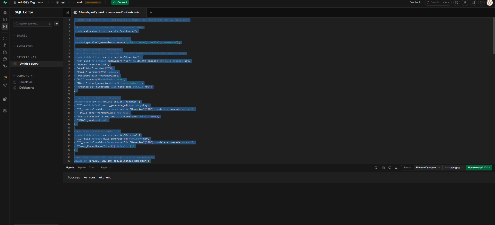

### 3.2. Ejecutar el script `Script_SQL_PathFinderAI.sql`

1. Abra el archivo `Script_SQL_PathFinderAI.sql` ubicado en la raíz del repositorio.
2. Copie **todo** su contenido y péguelo en el SQL Editor.
3. Pulse **Run** (o `Ctrl + Enter`).
4. Verifique que en la sección **Results** aparece *Success. No rows returned*.

**Captura 3.2** — Script SQL pegado en el editor y ejecutándose:


**Captura 3.3** — Tabla `Usuarios` creada correctamente tras ejecutar el script:

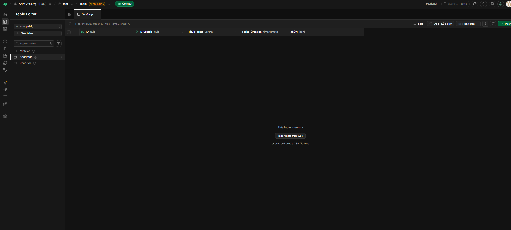

### 3.3. Comprobar las tablas creadas

Vaya a **Table Editor** en la barra lateral y confirme que aparecen las tablas:

- `Usuarios`
- `Roadmap`
- `Metrica`

**Captura 3.4** — Listado de tablas en el Table Editor de Supabase:


**Captura 3.5** — Estructura de la tabla `Roadmap` con sus columnas:


---

## 4. Ejecución del sistema

Con las dependencias instaladas y la base de datos lista, arranque los dos servidores **en terminales separadas**.

### 4.1. Arrancar la API

En una terminal posicionada en `api/`:

```bash
npm run dev
```

La API quedará disponible en <http://localhost:3000>. Debe ver un mensaje como:

```
🚀 API escuchando en http://localhost:3000
```

**Captura 4.1** — Terminal con la API ejecutándose en el puerto 3000:

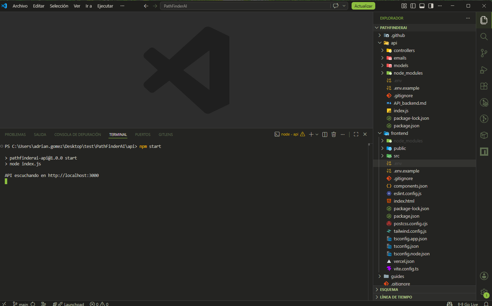

### 4.2. Arrancar el frontend

En otra terminal posicionada en `frontend/`:

```bash
npm run dev
```

Vite mostrará la URL local (normalmente <http://localhost:5173>).

**Captura 4.2** — Terminal con Vite ejecutándose y mostrando la URL del frontend:

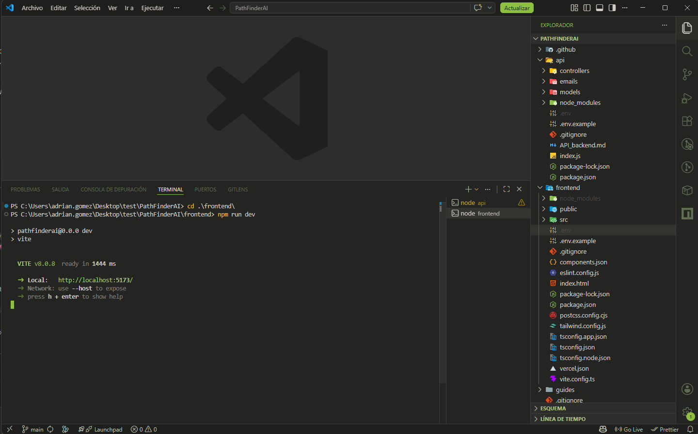

### 4.3. Abrir la aplicación en el navegador

Acceda a <http://localhost:5173>. Será redirigido a la pantalla de inicio de sesión.

**Captura 4.3** — Pantalla de login de PathFinderAI cargada en el navegador:

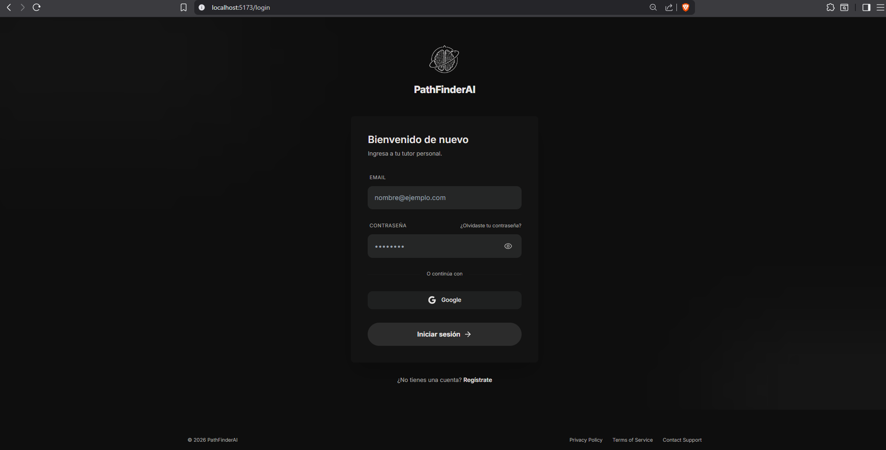

---

## 5. Ejecución de tests

PathFinderAI incluye **80 tests** (unitarios y de integración) que verifican el correcto funcionamiento de la aplicación.

### 5.1. Tests del Backend (Jest)

Desde una terminal posicionada en `api/`:

```bash
npm test
```

Este comando ejecuta las 7 suites de tests (66 tests en total) con Jest:

| Suite | Tipo | Tests |
| :--- | :--- | :--- |
| `generateController.test.js` | Unitario | 10 |
| `examController.test.js` | Unitario | 9 |
| `userController.test.js` | Unitario | 13 |
| `roadmapController.test.js` | Unitario | 10 |
| `adminController.test.js` | Unitario | 5 |
| `backendDb.test.js` | Integración | 6 |
| `frontendBackend.test.js` | Integración | 13 |

### 5.2. Tests del Frontend (Vitest)

Desde una terminal posicionada en `frontend/`:

```bash
npx vitest run
```

Este comando ejecuta 1 suite de tests (14 tests en total) con Vitest:

| Suite | Tipo | Tests |
| :--- | :--- | :--- |
| `sanitize.test.ts` | Unitario | 14 |

### 5.3. Resultado esperado

Todos los tests deben pasar correctamente:

```
Backend:  Test Suites: 7 passed — Tests: 66 passed
Frontend: Test Files:  1 passed — Tests: 14 passed
```

---

## 6. Verificación final

Para confirmar que la instalación es correcta, realice esta lista de comprobación:

| # | Comprobación | Resultado esperado |
| :--- | :--- | :--- |
| 1 | `GET http://localhost:3000/api/health` | `{ "status": "ok" }` |
| 2 | Página `/register` accesible | Formulario de registro visible |
| 3 | Registrar un usuario nuevo | Se recibe el email de confirmación |
| 4 | Iniciar sesión con el usuario creado | Redirección al dashboard |
| 5 | Generar un roadmap (p. ej. *"electricidad"*) | Aparece el grafo con varios nodos |
| 6 | Tabla `Usuarios` en Supabase | Contiene el usuario registrado |
| 7 | Tabla `Roadmap` en Supabase | Contiene el roadmap generado |

**Captura 5.1** — Respuesta JSON del endpoint `/api/health` en el navegador:

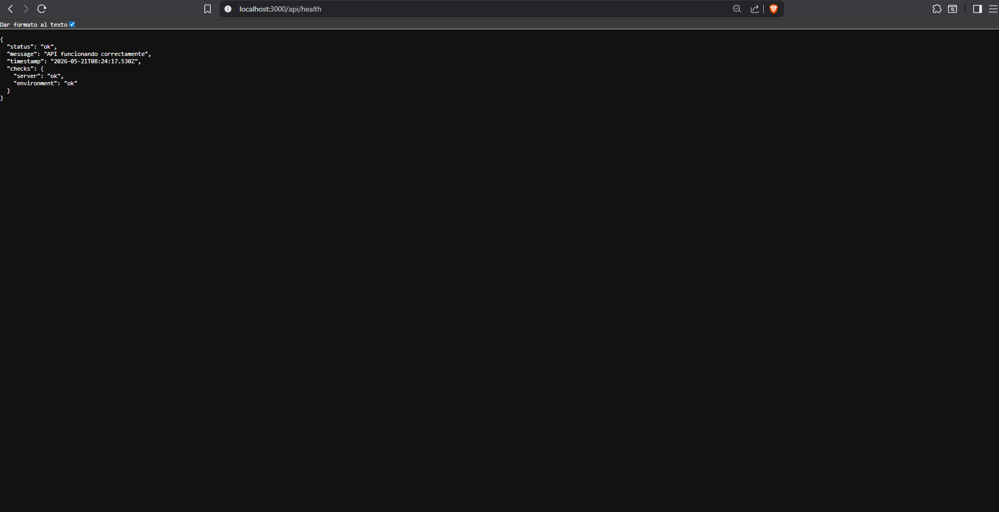

**Captura 5.2** — Dashboard de PathFinderAI tras iniciar sesión:

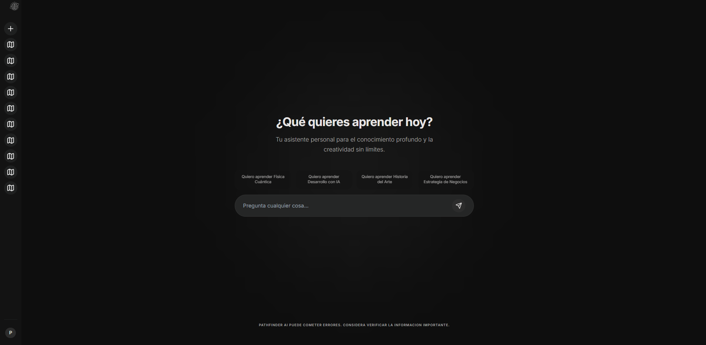

**Captura 5.3** — Roadmap recién generado y visualizado en el editor:

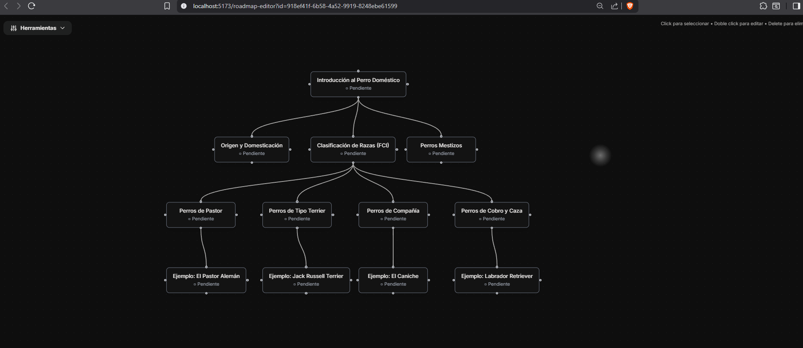


---

## 7. Resolución de problemas

| Síntoma | Causa probable | Solución |
| :--- | :--- | :--- |
| `EADDRINUSE: port 3000 already in use` | Hay otro proceso usando el puerto | Cierre el proceso o cambie el puerto en `api/index.js`. |
| `Invalid API key` al generar un roadmap | `GEMINI_API_KEY` incorrecta o ausente | Revise `api/.env` y reinicie la API. |
| Login con Google falla | URI de redirección no autorizado en Google Cloud o Supabase | Añada `http://localhost:5173` en orígenes y la URL de callback de Supabase. |
| Error `relation "Usuarios" does not exist` | El script SQL no se ejecutó completo | Vuelva a ejecutar `Script_SQL_PathFinderAI.sql` desde el SQL Editor. |
| CORS bloqueado en el navegador | `SITE_URL` en `api/.env` no coincide con el frontend | Ajuste `SITE_URL=http://localhost:5173` y reinicie la API. |
| `npm install` falla con `ERESOLVE` | Versión de Node antigua | Actualice Node.js a la versión 18 o superior. |

---

<div align="center">

✅ **¡Instalación completada!**

Continúe con el [Manual de Usuario](./Manual_de_Usuario_PathFinderAI.md) para aprender a utilizar PathFinderAI.

</div>
