# Manual de Usuario — PathFinderAI

**Versión:** 1.0  
**Fecha:** Mayo 2026  
**Aplicación:** PathFinderAI — Generador Inteligente de Rutas de Aprendizaje

---

## Tabla de Contenidos

1. [Introducción](#1-introducción)
2. [Acceso al Sistema](#2-acceso-al-sistema)
   - 2.1 [Registro de nueva cuenta](#21-registro-de-nueva-cuenta)
   - 2.2 [Confirmación de email](#22-confirmación-de-email)
   - 2.3 [Inicio de sesión](#23-inicio-de-sesión)
   - 2.4 [Inicio de sesión con Google](#24-inicio-de-sesión-con-google)
   - 2.5 [Recuperación de contraseña](#25-recuperación-de-contraseña)
   - 2.6 [Cierre de sesión](#26-cierre-de-sesión)
3. [Descripción de Funcionalidades](#3-descripción-de-funcionalidades)
   - 3.1 [Página Principal (Dashboard)](#31-página-principal-dashboard)
   - 3.2 [Barra Lateral (Sidebar)](#32-barra-lateral-sidebar)
   - 3.3 [Generación de Roadmaps con IA](#33-generación-de-roadmaps-con-ia)
   - 3.4 [Editor de Roadmap](#34-editor-de-roadmap)
   - 3.5 [Visor de Roadmap (Solo Lectura)](#35-visor-de-roadmap-solo-lectura)
   - 3.6 [Gestión de Recursos](#36-gestión-de-recursos)
   - 3.7 [Exámenes de Validación con IA](#37-exámenes-de-validación-con-ia)
   - 3.8 [Perfil de Usuario](#38-perfil-de-usuario)
   - 3.9 [Importación y Exportación de Roadmaps](#39-importación-y-exportación-de-roadmaps)
   - 3.10 [Panel de Administración](#310-panel-de-administración)
4. [Flujo de Trabajo](#4-flujo-de-trabajo)
5. [Capturas de Pantalla](#5-capturas-de-pantalla)

---

## 1. Introducción

**PathFinderAI** es una aplicación web que utiliza **Inteligencia Artificial (Google Gemini)** para generar rutas de aprendizaje personalizadas y estructuradas en forma de grafos interactivos. 

Características principales:

- **Generación automática de roadmaps** con IA según el tema que desees aprender.
- **Visualización interactiva** como grafos conectados (nodos y aristas) usando React Flow.
- **Seguimiento de progreso** marcando cada concepto como Pendiente, Estudiando o Aprendido.
- **Búsqueda automática de recursos** en YouTube y Wikipedia.
- **Exámenes tipo test** generados con IA para validar el conocimiento adquirido.
- **Diseño responsivo** con tema oscuro moderno.

---

## 2. Acceso al Sistema

### 2.1 Registro de nueva cuenta

**Ruta:** `/register`

Para crear una cuenta en PathFinderAI:

1. Acceda a la página principal y haga clic en el botón **"REGISTRARSE"**.
2. Complete el formulario con los siguientes datos:
   - **Nombre**: Su nombre.
   - **Apellidos**: Sus apellidos.
   - **Email**: Una dirección de correo electrónico válida.
   - **Contraseña**: Mínimo 6 caracteres.
   - **Repetir Contraseña**: Debe coincidir con la contraseña ingresada.
3. Haga clic en **"Registrarse"**.
4. Será redirigido a la página de confirmación de email.

> **Nota:** Si ya dispone de una cuenta, haga clic en el enlace *"Inicia sesión"* en la parte inferior del formulario.

**Captura — Pantalla de Registro:**

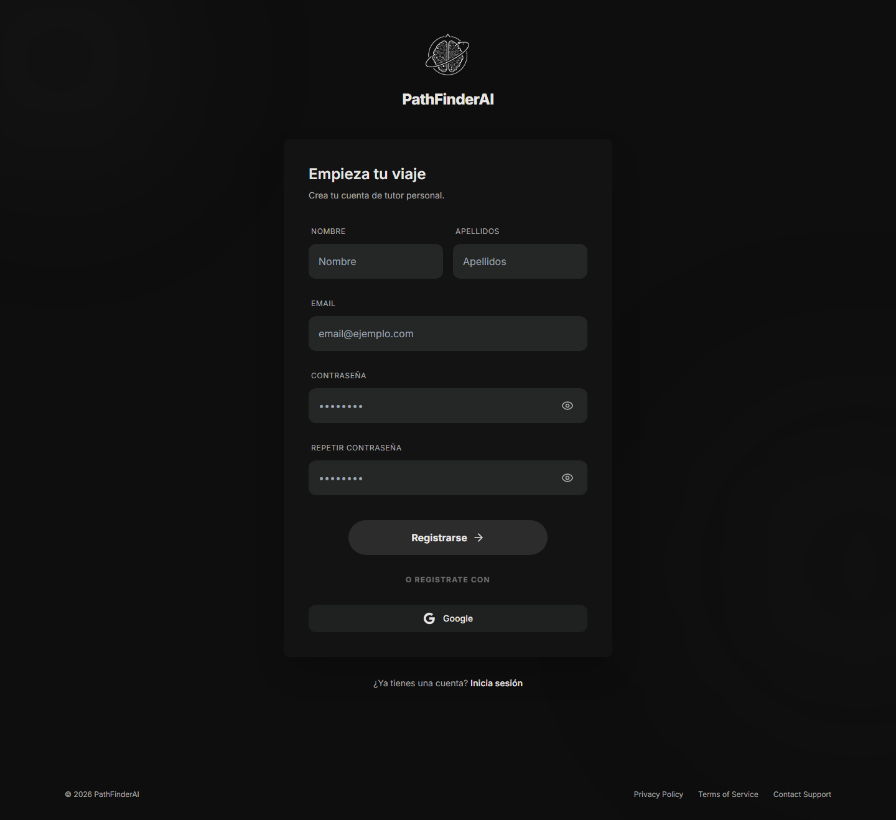

---

### 2.2 Confirmación de email

**Ruta:** `/confirm-email` → `/email-confirmed`

Tras el registro:

1. Se mostrará una página informativa indicando que se ha enviado un correo de confirmación.
2. Revise su bandeja de entrada (y la carpeta de spam) y haga clic en el **enlace de confirmación** que contiene el email.
3. Al hacer clic, será redirigido a la página `/email-confirmed` donde se confirma que su cuenta ha sido verificada.
4. Desde esa pantalla podrá acceder al **inicio de sesión**.

> **Importante:** El enlace de confirmación tiene un tiempo de validez limitado. Si expira, deberá registrarse de nuevo.

---

### 2.3 Inicio de sesión

**Ruta:** `/login`

Para acceder a su cuenta:

1. Acceda a la pantalla de login desde la página principal pulsando **"INICIAR SESIÓN"**.
2. Introduzca su **email** y **contraseña**.
3. Haga clic en **"Iniciar sesión"**.
4. Si las credenciales son correctas, será redirigido al **Dashboard principal** (`/`).

**Captura — Pantalla de Login:**

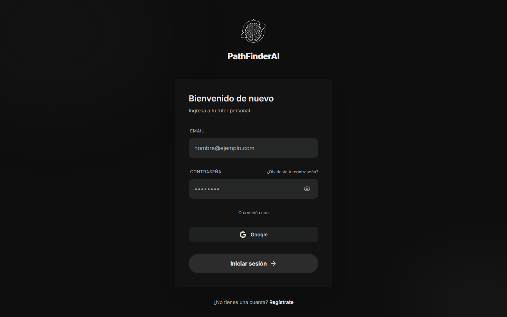

---

### 2.4 Inicio de sesión con Google

Desde la pantalla de login, también puede autenticarse con su cuenta de Google:

1. Haga clic en el botón de **Google Sign-In**.
2. Seleccione su cuenta de Google en la ventana emergente.
3. Si es su primera vez, se creará automáticamente una cuenta vinculada.
4. Será redirigido al Dashboard principal.

---

### 2.5 Recuperación de contraseña

**Ruta:** `/forgot-password` → `/reset-password`

Si ha olvidado su contraseña:

1. En la pantalla de login, haga clic en **"¿Olvidaste tu contraseña?"**.
2. Introduzca su **email** registrado.
3. Haga clic en **"Enviar instrucciones"**.
4. Recibirá un correo con un enlace para restablecer su contraseña.
5. Al hacer clic en el enlace, accederá a la página `/reset-password` donde podrá definir una **nueva contraseña**.
6. Tras guardar la nueva contraseña, será redirigido al login.

**Captura — Recuperar Contraseña:**

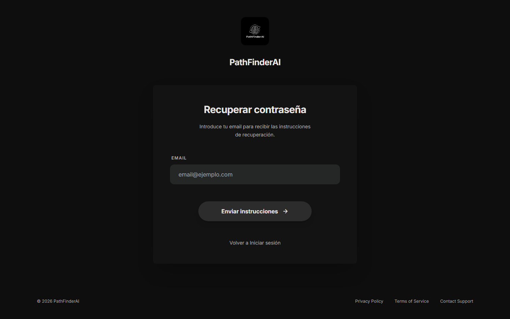

---

### 2.6 Cierre de sesión

Para cerrar sesión:

1. Haga clic en su **nombre de usuario** en la barra lateral (sidebar).
2. En el menú desplegable, seleccione **"Cerrar sesión"**.
3. Se eliminarán los datos de sesión y será redirigido a la página principal.

---

## 3. Descripción de Funcionalidades

### 3.1 Página Principal (Dashboard)

**Ruta:** `/`

El Dashboard es la pantalla central de la aplicación. Desde aquí el usuario puede:

- **Generar nuevos roadmaps** introduciendo un tema en el campo de búsqueda (ej: *"Quiero aprender Física Cuántica"*).
- **Ver todos sus roadmaps guardados** con su título y fecha de creación.
- **Acceder rápidamente** a cualquier roadmap en modo edición o lectura.
- **Importar archivos JSON** de roadmaps descargados previamente.

**Elementos visuales del Dashboard:**

| Elemento | Descripción |
|----------|-------------|
| Campo de búsqueda central | Área para introducir el tema a aprender |
| Botón "Generar con IA" | Inicia la generación del roadmap |
| Sugerencias rápidas | Botones con temas predefinidos (ej: *Física Cuántica*, *Desarrollo con IA*, *Historia del Arte*, *Estrategia de Negocios*) |
| Barra lateral (Sidebar) | Navegación y gestión de roadmaps |
| Aviso inferior | Recordatorio de que la IA puede cometer errores |

**Captura — Dashboard / Página Principal (sin sesión):**


---

### 3.2 Barra Lateral (Sidebar)

La sidebar aparece en el lado izquierdo y contiene:

| Sección | Descripción |
|---------|-------------|
| **Logo** | Logotipo de PathFinderAI |
| **+ Nuevo Roadmap** | Botón para crear un roadmap rápidamente |
| **Mis Roadmaps** | Lista de todos los roadmaps guardados en la nube. Cada uno muestra un icono de mapa y su título |
| **Mapas Importados** | Lista de archivos JSON importados localmente |
| **Menú de Usuario** | Nombre, email y opciones del usuario (parte inferior) |

**Opciones del Menú de Usuario (dropdown):**

| Opción | Descripción |
|--------|-------------|
| 👤 **Mi Perfil** | Abre el modal de edición de perfil |
| 📥 **Importar JSON** | Abre el diálogo de selección de archivo |
| ⚙️ **Admin** | Acceso al panel de administración (solo usuarios con rol admin) |
| 🚪 **Cerrar sesión** | Cierra la sesión actual |

**Menú contextual de cada roadmap (⋮):**

| Acción | Descripción |
|--------|-------------|
| ✏️ **Renombrar** | Edita el título del roadmap de forma inline |
| 📝 **Editar** | Abre el roadmap en el Editor completo |
| 👁️ **Ver** | Abre el roadmap en modo solo lectura (Viewer) |
| 🗑️ **Eliminar** | Borra el roadmap permanentemente |

**Captura — Sidebar con roadmaps:**

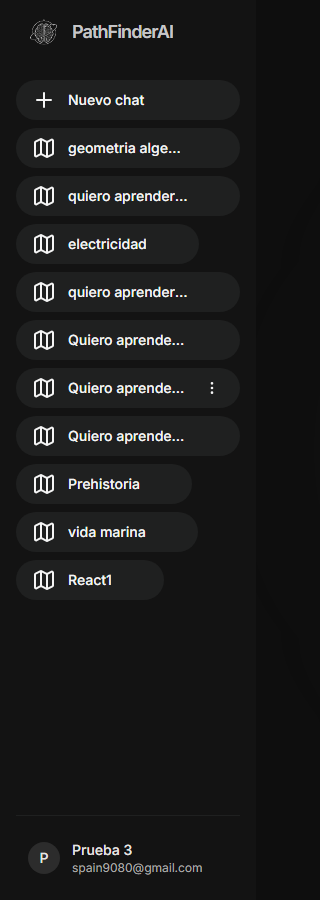

---

### 3.3 Generación de Roadmaps con IA

El proceso de generación funciona así:

1. El usuario escribe un tema en el campo de búsqueda (ej: *"electricidad"*, *"quiero aprender a coser"*).
2. Hace clic en **"Generar con IA"** (o pulsa Enter).
3. Se muestra una **barra de progreso** con mensajes de estado:
   - *"Analizando tema..."*
   - *"Creando estructura..."*
   - *"Organizando conceptos..."*
   - *"Finalizando..."*
   - *"Guardando..."*
   - *"Abriendo roadmap..."*
4. Google Gemini genera una estructura de nodos y conexiones en formato JSON.
5. El roadmap se guarda automáticamente en la base de datos.
6. Se abre automáticamente en el **Editor de Roadmap** en una nueva pestaña.

**Ejemplo real de roadmap generado — "Electricidad":**

La IA generó 13 nodos interconectados:

| Nodo | Tema | Horas estimadas |
|------|------|-----------------|
| 1 | Introducción a la Electricidad | 2h |
| 2 | Carga Eléctrica y sus Tipos (Protones, Electrones) | 2h |
| 3 | Corriente Eléctrica: Flujo de Carga (Amperios) | 2h |
| 4 | Voltaje (Diferencia de Potencial): Fuerza Impulsora | 2h |
| 5 | Resistencia Eléctrica: Oposición al Flujo (Ohmios) | 2h |
| 6 | Ley de Ohm (V=IR): Relación Fundamental | 3h |
| 7 | Potencia Eléctrica: Energía Consumida (Vatios) | 2h |
| 8 | Corriente Continua (DC): Conceptos y Ejemplos | 2h |
| 9 | Corriente Alterna (AC): Conceptos Básicos y Frecuencia | 3h |
| 10 | Componentes Básicos de un Circuito | 2h |
| 11-13 | Temas avanzados adicionales | 2-3h c/u |

> **Nota:** La complejidad del roadmap se adapta al nivel del usuario (principiante, medio, avanzado) configurado en su perfil.

**Captura — Generación en progreso:**

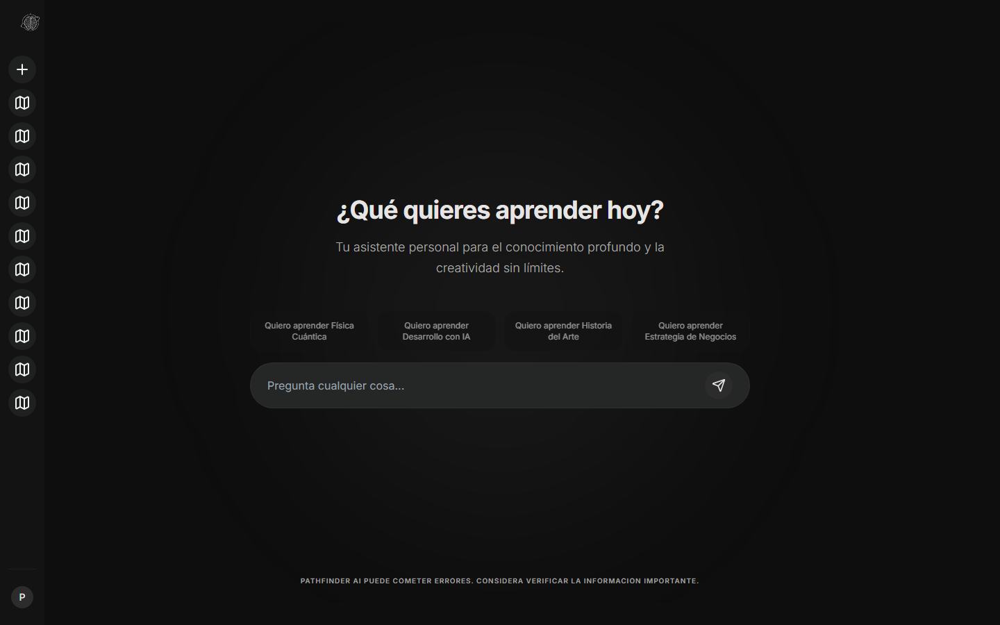

---

### 3.4 Editor de Roadmap

**Ruta:** `/roadmap-editor?id=<mapId>`

El editor es la interfaz principal para trabajar con los roadmaps. Se compone de tres áreas:

#### A. Canvas Visual (Área central)

El roadmap se visualiza como un **grafo interactivo** con nodos y aristas:

- **Nodos (rectángulos)**: Representan conceptos/temas a aprender.
  - Borde de color según el estado: 🟢 Verde = Aprendido | 🟡 Amarillo = Estudiando | ⚫ Gris = Pendiente
  - Muestran el nombre del concepto y el estado actual.
  - Permiten **arrastrar** para reposicionar.
  - **Doble clic** para renombrar el nodo inline.
  - **Clic** para seleccionar y abrir el panel lateral de detalles.
  - **Ctrl+Clic** para selección múltiple.

- **Aristas (líneas)**: Conexiones entre nodos que muestran las dependencias y el orden de aprendizaje.

- **Controles de navegación** (esquina inferior izquierda):
  - Zoom in / Zoom out
  - Ajustar a pantalla (Fit to View)
  - Mini-mapa en esquina inferior derecha

#### B. Panel de Herramientas (Lado izquierdo / menú contextual)

Herramientas disponibles al seleccionar nodos:

| Herramienta | Icono | Descripción |
|-------------|-------|-------------|
| **Agregar nodo** | ➕ | Crea un nuevo nodo con el nombre especificado |
| **Auto-layout** | 🔄 | Reorganiza todos los nodos automáticamente en jerarquía vertical usando el algoritmo Dagre |
| **Buscar recursos** | 🔍 | Busca vídeos en YouTube y artículos en Wikipedia sobre el tema del nodo seleccionado |
| **Cambiar color** | 🎨 | Abre un selector de color para personalizar el borde del nodo |
| **Eliminar nodos** | 🗑️ | Elimina los nodos seleccionados (con confirmación mostrando nodos hijos afectados) |
| **Exportar a JSON** | 📄 | Descarga el roadmap completo como archivo JSON |
| **Exportar a imagen** | 🖼️ | Descarga una captura PNG del roadmap actual |

#### C. Panel de Detalle del Nodo (Lado derecho)

Al hacer clic en un nodo, se abre un panel lateral con:

| Campo | Descripción |
|-------|-------------|
| **Título del nodo** | Nombre del concepto (editable) |
| **Estado** | Selector desplegable: *Pendiente* / *Estudiando* / *Aprendido* |
| **Color personalizado** | Selector de color para el borde del nodo |
| **Horas estimadas** | Tiempo estimado para completar el concepto |
| **Notas** | Campo de texto libre para anotaciones personales |
| **Recursos/Enlaces** | Lista de recursos asociados (YouTube, Wikipedia, enlaces manuales) |
| **Validar conocimiento** | Botón para iniciar un examen tipo test generado con IA |

#### D. Barra de Progreso del Roadmap

En la parte superior del editor se muestra:

- **Porcentaje de completado** del roadmap general.
- **Número de nodos** por estado (pendientes, estudiando, aprendidos).

#### E. Guardado

- **Guardado automático** en `sessionStorage` con cada cambio.
- **Botón "Guardar"** para persistir los cambios en la nube (base de datos Supabase).

**Captura — Editor de Roadmap con nodos:**

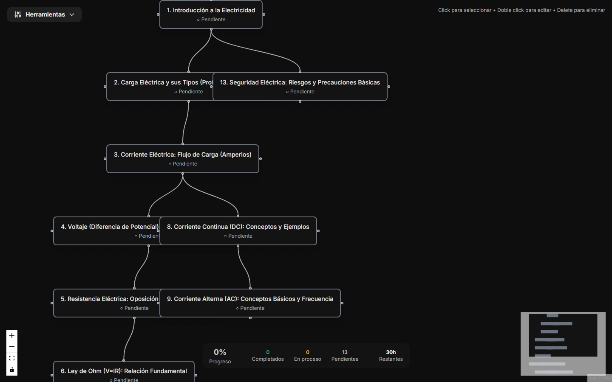

**Captura — Panel de detalle de nodo:**

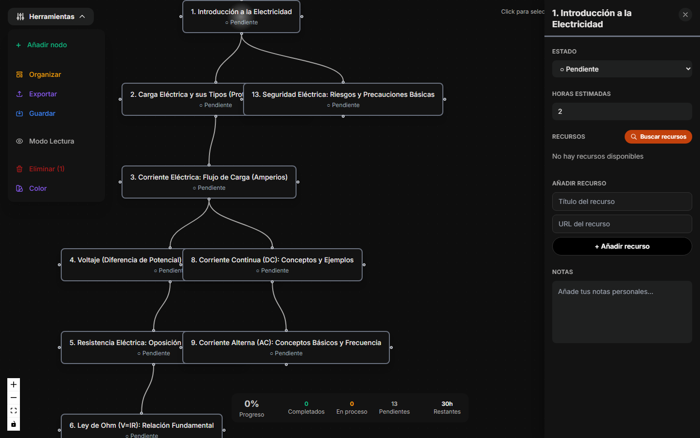

---

### 3.5 Visor de Roadmap (Solo Lectura)

**Ruta:** `/roadmap-viewer?id=<mapId>`

El visor muestra el roadmap de forma idéntica al editor, pero con las siguientes restricciones:

| Funcionalidad | Editor | Visor |
|---------------|--------|-------|
| Ver nodos y conexiones | ✅ | ✅ |
| Zoom y panorámica | ✅ | ✅ |
| Ver información de nodos | ✅ | ✅ |
| Mover nodos | ✅ | ❌ |
| Editar nombres | ✅ | ❌ |
| Crear nodos o aristas | ✅ | ❌ |
| Cambiar estados | ✅ | ❌ |
| Guardar cambios | ✅ | ❌ |

> **Uso principal:** En dispositivos móviles, los roadmaps se abren automáticamente en modo visor para mejor experiencia. También se usa para compartir roadmaps sin riesgo de edición accidental.

---

### 3.6 Gestión de Recursos

Cada nodo puede tener recursos educativos asociados:

#### Búsqueda automática

1. Seleccione un nodo haciendo clic sobre él.
2. En el panel lateral, haga clic en **"Buscar recursos"**.
3. El sistema busca automáticamente en:
   - 🎥 **YouTube**: Devuelve hasta 3 vídeos relacionados con el tema del nodo.
   - 📚 **Wikipedia**: Devuelve hasta 3 artículos relevantes.
4. Cada resultado muestra: miniatura/icono, título, descripción breve, tipo de recurso y enlace directo.
5. Haga clic en **"Agregar"** para vincular el recurso al nodo.

#### Agregar manualmente

1. Seleccione un nodo.
2. En la sección de recursos, introduzca:
   - **Título** del recurso.
   - **URL** del enlace.
3. Haga clic en **"Añadir recurso"**.

#### Eliminar recursos

- Haga clic en el icono **🗑️** junto al recurso para eliminarlo de la lista.

---

### 3.7 Exámenes de Validación con IA

PathFinderAI permite validar el conocimiento adquirido en cada nodo mediante exámenes generados con IA:

1. Seleccione un nodo y haga clic en **"Validar conocimiento"** en el panel lateral.
2. Se abre un **modal de examen** con una barra de progreso mientras la IA genera las preguntas.
3. El examen consiste en **3 preguntas tipo test**:
   - Cada pregunta tiene **4 opciones** (a, b, c, d).
   - Solo hay **una respuesta correcta**.
4. **Flujo del examen:**
   - Lea la pregunta y seleccione una respuesta.
   - Haga clic en **"Enviar respuesta"**.
   - Se muestra si la respuesta fue **correcta o incorrecta**, junto con la **explicación**.
   - Avance a la siguiente pregunta.
5. **Al finalizar las 3 preguntas:**
   - Se calcula la **puntuación** (porcentaje de aciertos).
   - Si obtiene **≥ 70% de aciertos**, el examen se considera **aprobado** y el nodo se marca automáticamente como **"Aprendido"** (estado verde).
   - Se muestra un resumen con el resultado y un icono de certificado.

**Captura — Examen de validación:**

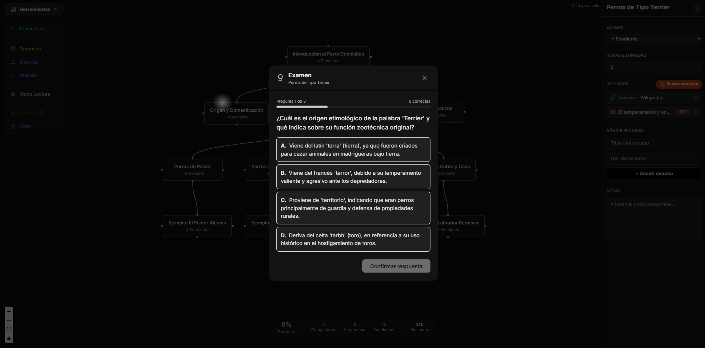

---

### 3.8 Perfil de Usuario

Acceda al perfil desde el menú de usuario en la sidebar → **"Mi Perfil"**.

El modal de perfil tiene **3 pestañas**:

#### Pestaña "Perfil"

| Campo | Descripción |
|-------|-------------|
| **Nombre** | Su nombre de pila |
| **Apellidos** | Sus apellidos |
| **Nivel** | Su nivel de conocimiento: *Principiante*, *Medio* o *Avanzado*. Este dato influye en la complejidad de los roadmaps generados por la IA |

Haga clic en **"Guardar cambios"** para actualizar.

#### Pestaña "Seguridad"

Permite cambiar su contraseña:

1. Introduzca su **contraseña actual**.
2. Introduzca la **nueva contraseña**.
3. Confirme la nueva contraseña.
4. Haga clic en **"Cambiar contraseña"**.

#### Pestaña "Eliminar Cuenta"

Permite eliminar permanentemente su cuenta y todos los roadmaps asociados. Requiere confirmación de seguridad.

> **Advertencia:** Esta acción es irreversible. Todos sus datos serán eliminados permanentemente.

---

### 3.9 Importación y Exportación de Roadmaps

#### Exportar roadmap

Desde el editor de roadmap:

1. Abra el menú de herramientas.
2. Seleccione:
   - **"Exportar a JSON"**: Descarga un archivo `.json` con toda la estructura del roadmap (nodos, aristas, estados, recursos).
   - **"Exportar a imagen"**: Descarga un archivo `.png` con la captura visual del grafo.

#### Importar roadmap (JSON)

1. Desde el Dashboard o la sidebar, seleccione **"Importar JSON"**.
2. Seleccione un archivo `.json` previamente exportado.
3. El mapa importado aparecerá en la sección **"Mapas Importados"** de la sidebar.
4. Haga clic sobre él para abrirlo en el editor o visor.

> **Nota:** Los mapas importados se almacenan temporalmente en el navegador (`sessionStorage`). Se perderán al cerrar la pestaña del navegador. Para conservarlos, guárdelos desde el editor usando el botón "Guardar".

---

### 3.10 Panel de Administración

**Ruta:** `/admin`

Accesible solo para usuarios con rol **admin**.

#### Estadísticas generales

| Métrica | Descripción |
|---------|-------------|
| **Total de usuarios** | Número total de usuarios registrados en la plataforma |
| **Total de roadmaps** | Número total de roadmaps generados por todos los usuarios |
| **Gráfico de tendencia** | Gráfico de líneas mostrando los registros de usuarios en los últimos 30 días (Eje X: fechas, Eje Y: cantidad) |

#### Tabla de temas consultados

Lista de todos los temas que los usuarios han usado para generar roadmaps:

| Columna | Descripción |
|---------|-------------|
| **Usuario** | Email del usuario que generó el roadmap |
| **Tema** | Tema consultado |

**Captura — Panel de Administración:**

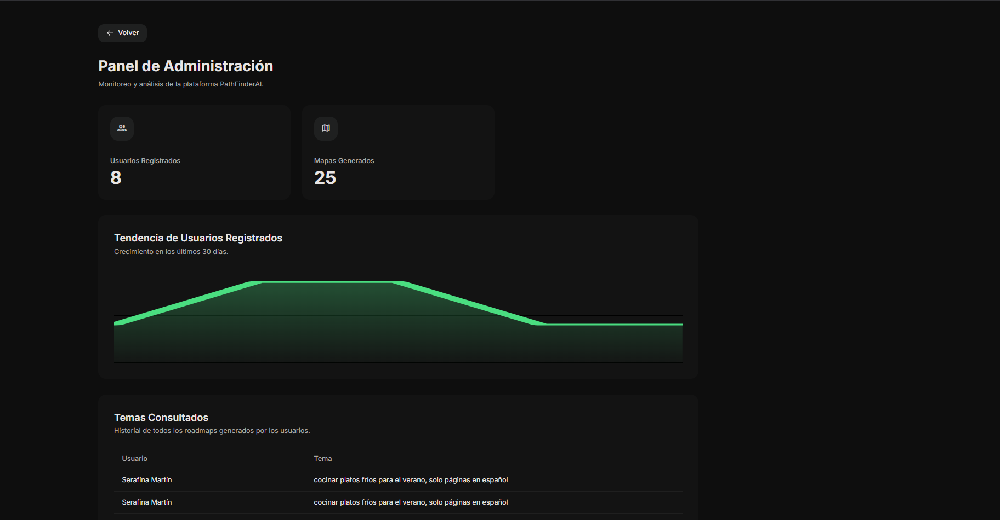

---

## 4. Flujo de Trabajo

A continuación se describe el flujo de trabajo típico de un usuario en PathFinderAI:

```
┌─────────────────────────────────────────────────────────────────────┐
│                      FLUJO DE TRABAJO                               │
└─────────────────────────────────────────────────────────────────────┘

  ┌──────────┐     ┌─────────────────┐     ┌───────────────────┐
  │ REGISTRO │────▶│ CONFIRMAR EMAIL │────▶│  INICIAR SESIÓN   │
  └──────────┘     └─────────────────┘     └───────┬───────────┘
                                                   │
                                                   ▼
                                        ┌─────────────────────┐
                                        │     DASHBOARD       │
                                        │ (Página principal)  │
                                        └──────┬──────────────┘
                                               │
                         ┌─────────────────────┼─────────────────────┐
                         │                     │                     │
                         ▼                     ▼                     ▼
               ┌─────────────────┐  ┌──────────────────┐  ┌─────────────────┐
               │ GENERAR ROADMAP │  │ ABRIR ROADMAP    │  │ IMPORTAR JSON   │
               │   CON IA       │  │ EXISTENTE        │  │                 │
               └────────┬────────┘  └────────┬─────────┘  └────────┬────────┘
                        │                    │                     │
                        └────────────────────┼─────────────────────┘
                                             │
                                             ▼
                                  ┌──────────────────────┐
                                  │   EDITOR DE ROADMAP  │
                                  │                      │
                                  │  • Explorar nodos    │
                                  │  • Cambiar estados   │
                                  │  • Buscar recursos   │
                                  │  • Agregar nodos     │
                                  │  • Personalizar      │
                                  └──────────┬───────────┘
                                             │
                              ┌──────────────┼──────────────┐
                              │              │              │
                              ▼              ▼              ▼
                   ┌──────────────┐ ┌──────────────┐ ┌──────────────┐
                   │  BUSCAR      │ │   VALIDAR    │ │  EXPORTAR    │
                   │  RECURSOS    │ │ CONOCIMIENTO │ │  (JSON/PNG)  │
                   │ (YT + Wiki)  │ │  (EXAMEN IA) │ │              │
                   └──────────────┘ └──────┬───────┘ └──────────────┘
                                           │
                                           ▼
                                  ┌──────────────────┐
                                  │   RESULTADO      │
                                  │  ≥70% = APROBADO │
                                  │  Nodo → Aprendido│
                                  └──────────────────┘
```

### Paso a paso detallado:

1. **Regístrese** con su email, nombre y contraseña.
2. **Confirme su email** haciendo clic en el enlace recibido por correo.
3. **Inicie sesión** con sus credenciales o con Google.
4. En el **Dashboard**, escriba el tema que desea aprender (ej: *"Electricidad"*).
5. Haga clic en **"Generar con IA"** y espere a que se genere el roadmap.
6. El **Editor de Roadmap** se abrirá automáticamente con el grafo generado.
7. **Explore los nodos** haciendo clic sobre cada concepto para ver sus detalles.
8. **Busque recursos** (vídeos de YouTube, artículos de Wikipedia) para cada nodo.
9. **Estudie** los recursos y cambie el estado del nodo a *"Estudiando"*.
10. Cuando se sienta preparado, haga clic en **"Validar conocimiento"** para realizar un examen.
11. Si **aprueba** el examen (≥70%), el nodo se marcará como *"Aprendido"*.
12. **Repita** el proceso con el siguiente nodo siguiendo el orden sugerido por las conexiones.
13. **Guarde** su progreso periódicamente con el botón "Guardar".
14. **Exporte** su roadmap como JSON o imagen cuando lo desee.

---

## 5. Capturas de Pantalla

A continuación se presenta un resumen visual de las pantallas principales de PathFinderAI:

### 5.1 Página de Bienvenida (sin sesión)

La página de inicio muestra el logo de PathFinderAI, un campo de búsqueda central con la pregunta *"¿Qué quieres aprender hoy?"*, sugerencias rápidas de temas, y botones para iniciar sesión o registrarse.

> **Elementos:** Logo, campo de búsqueda, 4 sugerencias (Física Cuántica, Desarrollo con IA, Historia del Arte, Estrategia de Negocios), botones INICIAR SESIÓN y REGISTRARSE, aviso de IA.

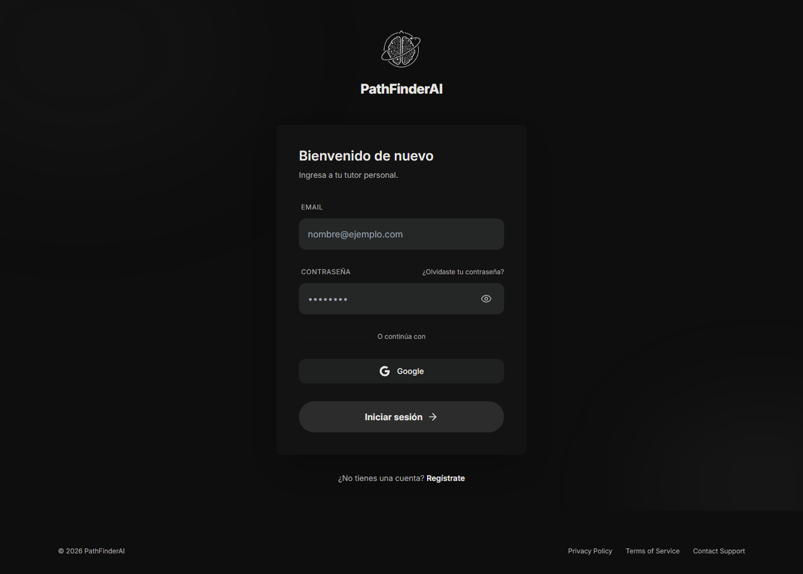

---

### 5.2 Pantalla de Login

Formulario de inicio de sesión con el logo de PathFinderAI, campos de email y contraseña, enlace de recuperación de contraseña, botón de iniciar sesión, y enlace a registro.

> **Elementos:** Logo, título "Bienvenido de nuevo", campos Email y Contraseña, enlace "¿Olvidaste tu contraseña?", botón "Iniciar sesión", enlace "Regístrate".


---

### 5.3 Pantalla de Registro

Formulario de registro con campos para nombre, apellidos, email, contraseña y confirmación de contraseña.

> **Elementos:** Logo, título "Empieza tu viaje", campos Nombre, Apellidos, Email, Contraseña, Repetir Contraseña, botón "Registrarse", enlace "Inicia sesión".


---

### 5.4 Recuperación de Contraseña

Formulario simple con campo de email y botón para enviar instrucciones de recuperación.

> **Elementos:** Logo, título "Recuperar contraseña", descripción, campo Email, botón "Enviar instrucciones", enlace "Volver a Iniciar sesión".


---

### 5.5 Dashboard (con sesión)

Vista principal con la sidebar abierta mostrando los roadmaps guardados del usuario, y el área central con el campo de búsqueda para generar nuevos roadmaps.


---

### 5.6 Editor de Roadmap

Vista del editor mostrando un grafo interactivo con nodos conectados por aristas. Cada nodo tiene un borde de color según su estado. El panel lateral derecho muestra los detalles del nodo seleccionado.


---

### 5.7 Panel de Detalle de Nodo

Panel lateral que muestra: título del nodo, selector de estado (Pendiente/Estudiando/Aprendido), horas estimadas, notas personales, recursos vinculados y botón de validar conocimiento.


---

### 5.8 Examen de Validación

Modal de examen con pregunta tipo test, 4 opciones de respuesta, barra de progreso indicando la pregunta actual (1/3, 2/3, 3/3), y resultado al finalizar.


---

### 5.9 Perfil de Usuario

Modal de perfil con tres pestañas: Perfil (nombre, apellidos, nivel), Seguridad (cambio de contraseña) y Eliminar Cuenta.

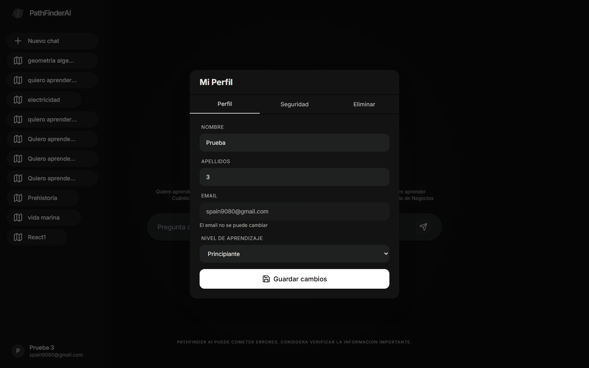

---

### 5.10 Panel de Administración

Panel con métricas: total de usuarios, total de roadmaps, gráfico de tendencia de registros (últimos 30 días), y tabla de temas consultados.


---

*© 2026 PathFinderAI. Todos los derechos reservados.*
